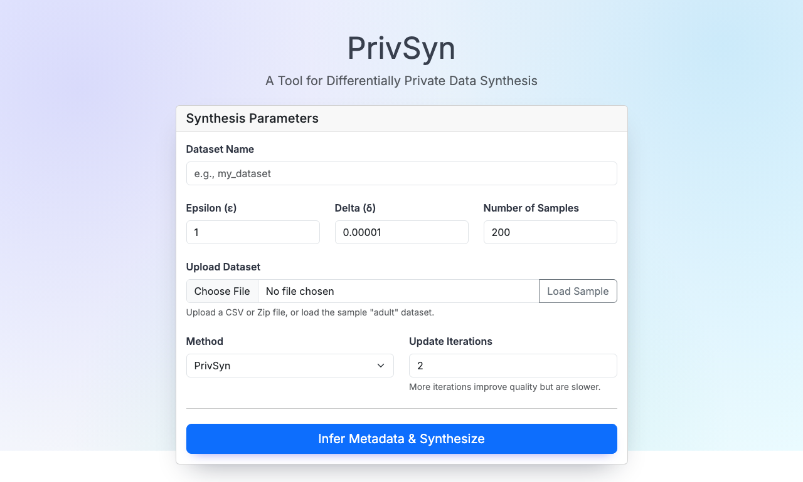
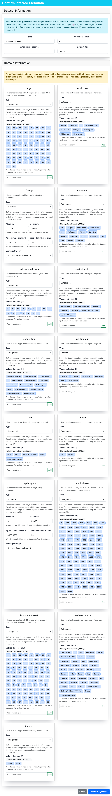
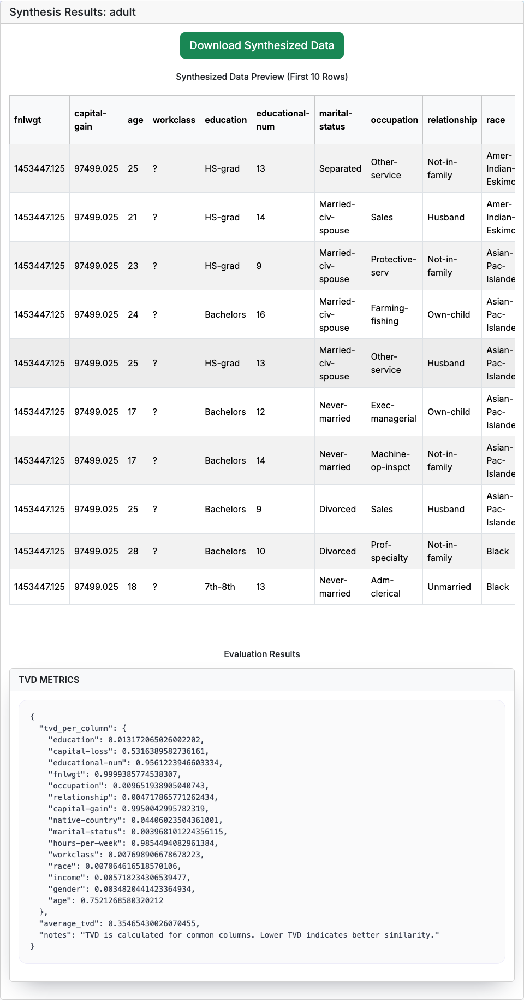
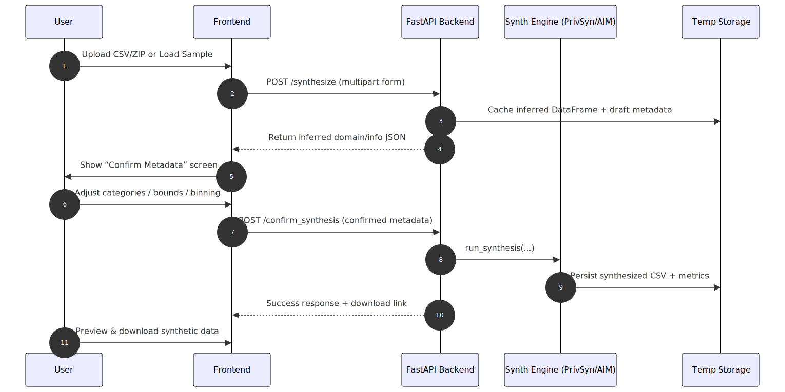

# PrivSyn - Differentially Private Data Synthesis 

> End-to-end tooling for creating differentially private tabular datasets with PrivSyn and AIM.

## Demo


1. **Upload & configure:** pick a synthesis method, dataset name, privacy budget, and either upload your CSV or load the bundled `adult` sample.
2. **Confirm metadata:** skim the summary card, then fine-tune per-column settings (categorical domains, numeric bounds, binning choices).
3. **Review results:** download the synthesized CSV, preview the first rows, and inspect metadata-aware evaluation metrics.

<p align="center">
  
</p>

<p align="center">
  
</p>

<p align="center">
  
</p>

> These screenshots were generated with `python scripts/capture_ui_screenshots.py`. The script drives a Playwright browser through the sample flow and can be rerun whenever the UI changes.

For a deeper walkthrough of each step (UI wiring, API payloads, evaluation metrics), check out [docs/frontend.md](docs/frontend.md) and [docs/backend.md](docs/backend.md).

## Highlights

- **Unified web app.** Upload a dataset, review inferred metadata, tweak categorical/numerical encodings, and download synthesized data in minutes.
- **Two synthesis engines.** PrivSyn (rho-CDP, iterative marginal updates) and AIM (adaptive measurement selection) exposed behind the same API.
- **Notebook-friendly modules.** Reusable preprocessing (PrivTree, DAWA), marginal selection, and synthesis utilities under `method/synthesis/privsyn` and `method/preprocess_common`.
- **Coverage-first test suite.** 100+ pytest cases plus Playwright E2E flows keep the UI/back-end contract in check.
- **MkDocs documentation.** Browse the Markdown guides with `mkdocs serve` (install via `pip install mkdocs`) and open <http://127.0.0.1:8000/> for a structured site.
- **Built on published research.** The core algorithms follow [PrivSyn: Differentially Private Data Synthesis (USENIX Security 2021)](https://www.usenix.org/system/files/sec21-zhang-zhikun.pdf) and [The AIM Mechanism for Differentially Private Synthetic Data (PVLDB 2022)](https://www.vldb.org/pvldb/vol15/p2599-mckenna.pdf).

## Quick Start

### Clone & setup

```bash
git clone https://github.com/vvv214/privsyn-tabular.git
cd privsyn-tabular
python3 -m venv .venv
source .venv/bin/activate  # Windows: .venv\Scripts\activate
python3 -m pip install -r requirements.txt
```

### Backend (FastAPI)

```bash
uvicorn web_app.main:app --reload --port 8001
```

The API is now live at `http://127.0.0.1:8001`. Docs: `http://127.0.0.1:8001/docs`.

### Frontend (Vite + React)

```bash
cd frontend
npm install
npm run dev -- --port 5174
```

Visit `http://127.0.0.1:5174`. The frontend defaults to `http://127.0.0.1:8001` unless `VITE_API_BASE_URL` is set.

### Try the sample dataset

1. Launch both servers.
2. Open the app and click **Load Sample** (loads `adult.csv.zip`).
3. Confirm metadata (tweak domains if desired) and click **Confirm & Synthesize**.
4. Download the resulting CSV or explore the preview table.
5. Want a quick preview without running anything? Check `docs/sample_output/` for a tiny synthetic CSV and matching metrics JSON.

### Refresh UI screenshots (optional)

We keep the screenshots in `docs/media/` up to date via Playwright:

```bash
python3 scripts/capture_ui_screenshots.py
```

The script starts both dev servers (or reuses them if already running), walks through the sample adult dataset, and writes:

- `docs/media/ui_form.png`
- `docs/media/ui_metadata_overview.png`
- `docs/media/ui_metadata_column.png`
- `docs/media/ui_results.png`

> Make sure Playwright browsers are installed once with `playwright install`, and no other process is already bound to ports `8001` / `5174`.

## Architecture Diagrams

<p><em>All diagrams live in <code>docs/media/</code>; replace or expand them to match your deployment.</em></p>

### End-to-end sequence



Shows how the user-facing frontend interacts with the FastAPI backend: upload → metadata inference → confirmation → synthesis → download.

### PrivSyn pipeline



Highlights the preprocessing stage (metadata normalisation), the PrivSyn core (marginal selection + GUM), and post-processing steps (storage/evaluation).

### AIM workflow



Summarises AIM’s adaptive measurement loop: initialise workload → iteratively measure queries with DP noise → update the model → generate synthetic data.

### Request flow


Illustrates the main request/response boundaries between frontend, backend, synthesis engines, and temporary storage.

## Testing

### Install test tooling

- `python3 -m pip install -r requirements.txt pytest-cov` – Python dependencies plus the coverage plugin used by CI.
- `npm install --prefix frontend` – React/Vite dependencies for component tests.
- `python3 -m playwright install` – one-time browser download for Playwright end-to-end flows.

### Quick commands

- `pytest -q` – run the full Python suite with terse output.
- `pytest -q -m "not slow"` – skip expensive markers while iterating.
- `pytest --cov=. --cov-report=term` – collect coverage locally (requires `pytest-cov`).
- `pytest -q -W error::DeprecationWarning -W error::FutureWarning -k "web_app or method/preprocess_common or method/synthesis/privsyn"` – enforce warning hygiene on core modules.

### Targeted runs

```bash
# Focus on metadata / preprocessing helpers
pytest -q test/test_metadata_overrides.py test/test_preprocessing.py test/test_data_inference.py

# Exercise the PrivSyn API contract only
pytest -q -k privsyn
```

### Frontend & E2E

```bash
# Component tests (Vitest)
cd frontend
npm test -- --run

# Browser E2E flows (requires backend + frontend running)
E2E=1 pytest -q -k e2e
```

> Tip: set `PLAYWRIGHT_HEADLESS=0` if you want to watch the E2E browser session while debugging.

## Documentation & Diagrams

- Local preview: `pip install mkdocs && mkdocs serve` exposes the docs at <http://127.0.0.1:8000/> with search + navigation.
- CI build: `.github/workflows/deploy-docs.yml` publishes MkDocs output to the `gh-pages` branch on every push to `main`.
- Vercel publish: point a secondary Vercel project at `gh-pages` (output dir `.`) and update `vercel.json` rewrites to proxy `/docs/*` to that URL.
- Optional hook: store `VERCEL_DOCS_DEPLOY_HOOK_URL` as a secret so the GitHub Action can trigger a redeploy after pushing docs.
- Diagrams live under `docs/media/` (`sequence.svg`, `privsyn.svg`, `aim.svg`, `flow.svg`) and drive the architecture section above—replace them with your own exports as needed.

## Codebase Overview

| Path | Description |
|------|-------------|
| `frontend/` | React + Vite SPA (upload flow, metadata editors, results view). |
| `web_app/` | FastAPI backend: metadata inference, synthesis orchestration, evaluation endpoints. |
| `method/api/` | Unified interface (`SynthRegistry`, `PrivacySpec`, `RunConfig`) that normalises every synthesis engine. |
| `method/synthesis/privsyn/` | PrivSyn implementation (marginal selection, GUM synthesis, helpers). |
| `method/synthesis/AIM/` | AIM adapter and reference engine wired into the shared registry. |
| `method/preprocess_common/` | Discretisers (PrivTree, DAWA) and preprocessing pipelines shared across methods. |
| `test/` | Pytest suite; `test/e2e/` houses Playwright browser flows. |
| `sample_data/` | Fixture datasets for local trials (`adult.csv.zip`, etc.). |
| `scripts/` | Automation helpers for booting servers, benchmarks, and screenshot capture. |

### Backend flow

- `web_app/data_inference.py` infers column metadata and returns draft `domain.json` / `info.json` payloads to the UI.
- `web_app/synthesis_service.py` rebuilds tabular data, routes execution to the selected engine, and persists session artefacts.
- `web_app/data_comparison.py` computes evaluation metrics and surfaces them via `/evaluate` and the results screen.

### Synthesis engines

- PrivSyn lives in `method/synthesis/privsyn/privsyn.py`, combining marginal selection with the GUM generator.
- AIM’s adapter (`method/synthesis/AIM/adapter.py`) maps the unified `prepare` / `run` hooks onto the original workflow so the backend treats both engines identically.

### Preprocessing & metadata helpers

- **PrivTree (`method/preprocess_common/privtree.py`)** – noisy hierarchical binning with inverse transforms.
- **DAWA (`method/preprocess_common/dawa.py`)** – adaptive workload partitioning used within AIM.
- Deterministic tests (`test/test_privtree.py`, `test/test_dawa.py`) ensure these helpers remain stable.

## Deployment Notes

- `./scripts/start_backend.sh` and `./scripts/start_frontend.sh` wrap the dev commands; pass `prod` to emit gunicorn builds and copy static assets.
- Cloud Run / container deploys: build via Docker, configure `VITE_API_BASE_URL` for the frontend, and extend `allow_origins` in `web_app/main.py` for any new domains.
- Free Cloud Run tiers cap CPU/memory/time—large datasets or AIM runs can hit those limits. If you expect heavier jobs, download the repo and run the backend locally instead.
- CORS extras: set `ADDITIONAL_CORS_ORIGINS` (comma-separated) to whitelist preview/prod frontends without code changes.
- Temp storage: override `PRIVSYN_DATA_ROOT` / `PRIVSYN_EXP_ROOT` if you need deterministic artefact paths (CI caches, shared volumes, etc.).

## Contributing

1. Fork & branch (`git checkout -b feat/awesome-improvement`).
2. Keep diffs focused, add/update tests, and run `pytest -q` before pushing.
3. Follow Conventional Commits (`feat:`, `fix:`, `chore(scope):`, etc.).
4. Attach screenshots or GIFs for UI-facing changes (store assets under `docs/media/`).

## License

PrivSyn is released under the [MIT License](LICENSE).

---

> Need help? Open an issue or ping us on GitHub Discussions – we love hearing about new differential privacy use-cases!
